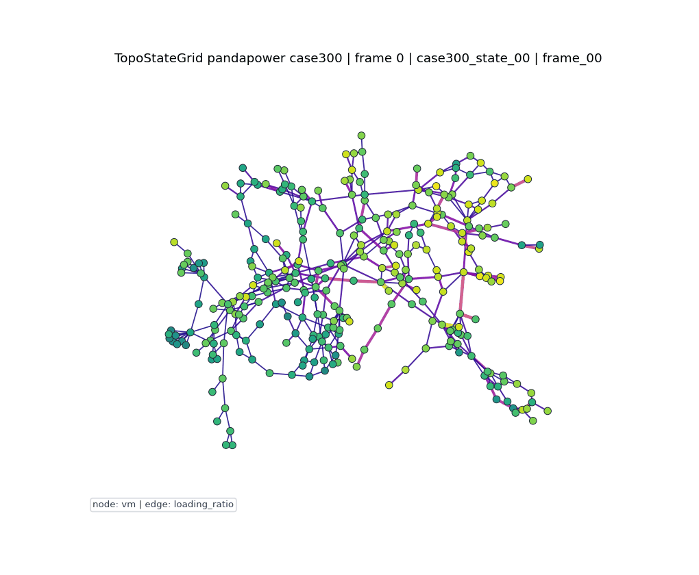

# TopoStateGrid

[English](https://github.com/MingLeiZhou/TopoStateGrid/blob/main/README.md) | [中文](https://github.com/MingLeiZhou/TopoStateGrid/blob/main/README_zh.md) | [Português](https://github.com/MingLeiZhou/TopoStateGrid/blob/main/README_pt.md)

TopoStateGrid is a physically informed graph construction method that converts power-grid topology, component attributes, and operating-state variables into machine-learning-ready graph datasets.

O nome de importação em Python é:

```python
import topostategrid
```

TopoStateGrid foca em uma pipeline simples e reutilizável para dados de sistemas elétricos: carregar dados da rede, construir amostras em grafo, salvar datasets, criar divisões, normalizar atributos e, opcionalmente, renderizar sequências de grafos para inspeção.

## O Que Ele Constrói

Cada amostra de grafo representa:

```text
G_t = (V, E, X_t, A_t, y_t)
```

onde:

- `V` são nós de barras.
- `E` são conexões físicas, como linhas e transformadores.
- `X_t` contém atributos dos nós em um cenário ou timestamp.
- `A_t` contém atributos das arestas em um cenário ou timestamp.
- `y_t` é um rótulo opcional.

A saída é um objeto homogêneo bus-branch do PyTorch Geometric:

```text
data.x
data.edge_index
data.edge_attr
data.y
data.network_id
data.sample_id
data.timestamp
data.scenario_id
data.contingency_id
data.node_feature_names
data.edge_feature_names
data.metadata
```

As arestas são armazenadas em ambas as direções para facilitar message passing. Metadados específicos de cada fonte são armazenados como uma string JSON, não como dicionários Python, para permitir batching seguro com `DataLoader` do PyG.

## Instalação

Pelo PyPI:

```bash
python -m pip install TopoStateGrid
```

Dependências opcionais:

```bash
python -m pip install "TopoStateGrid[pandapower]"
python -m pip install "TopoStateGrid[visual]"
python -m pip install "TopoStateGrid[test]"
```

A partir do repositório local:

```bash
git clone https://github.com/MingLeiZhou/TopoStateGrid.git
cd TopoStateGrid
python -m pip install -e ".[test,pandapower,visual]"
```

## Entradas Suportadas

TopoStateGrid v1.1 suporta:

| Fonte | Status | Observações |
| --- | --- | --- |
| OPFData JSON | Suportado | Usa amostras JSON extraídas e campos de estado resolvido quando disponíveis. |
| MATPOWER / PGLib `.m` | Suportado | Analisa `mpc.bus` e `mpc.branch`; casos estáticos não têm fluxos resolvidos por padrão. |
| pandapower `net` | Suportado, opcional | Requer `TopoStateGrid[pandapower]`; suporta barras, linhas e transformadores. |
| pandas DataFrame | Suportado | Útil para tabelas customizadas de barras, ramos e estados. |
| CSV | Suportado | Interface de conveniência baseada em DataFrames. |

O parser MATPOWER aceita linhas delimitadas por vírgula ou espaço, ponto e vírgula, comentários `%`, notação científica, matrizes em múltiplas linhas e matrizes explicitamente vazias como `mpc.branch = [ ];`.

## Esquema de Atributos

Ordem dos atributos dos nós:

```text
bus_status, bus_type, pd, qd, vm, va, vmax, vmin, normalized_demand
```

Ordem dos atributos das arestas:

```text
component_type, r, x, b_from, b_to, rate_a, pf, qf, pt, qt, loading_ratio, outage_flag
```

Campos numéricos opcionais ausentes são preenchidos com zero após validação. Para linhas do pandapower, `rate_a` usa `max_i_ka` como proxy aproximado quando não há uma potência MVA nominal direta.

## Início Rápido

Construir um grafo a partir de tabelas pandas:

```python
import pandas as pd
from topostategrid import build_graph_from_tables

bus_df = pd.DataFrame({
    "bus_id": [1, 2, 3],
    "bus_type": [3, 1, 1],
    "pd": [0.0, 1.5, 0.8],
    "qd": [0.0, 0.4, 0.2],
})

branch_df = pd.DataFrame({
    "from_bus": [1, 2],
    "to_bus": [2, 3],
    "r": [0.01, 0.02],
    "x": [0.05, 0.06],
})

data = build_graph_from_tables(
    bus_df,
    branch_df,
    network_id="toy_3bus",
    sample_id="sample_0",
)
```

Construir a partir de CSV:

```python
from topostategrid import build_graph_from_csv_tables

data = build_graph_from_csv_tables(
    "bus.csv",
    "branch.csv",
    network_id="toy_3bus",
)
```

Construir a partir de pandapower:

```python
import pandapower as pp
from topostategrid import build_graph_from_pandapower

net = pp.create_empty_network()
b1 = pp.create_bus(net, vn_kv=110)
b2 = pp.create_bus(net, vn_kv=110)
b3 = pp.create_bus(net, vn_kv=110)

pp.create_ext_grid(net, b1)
pp.create_load(net, b2, p_mw=10.0, q_mvar=3.0)
pp.create_line_from_parameters(net, b1, b2, 1.0, 0.1, 0.2, 0.0, 0.4)
pp.create_line_from_parameters(net, b2, b3, 1.0, 0.1, 0.2, 0.0, 0.4)
pp.runpp(net)

data = build_graph_from_pandapower(net, network_id="pandapower_3bus")
```

Batching de grafos de diferentes fontes:

```python
from torch_geometric.loader import DataLoader

loader = DataLoader([graph_a, graph_b, graph_c], batch_size=3)
batch = next(iter(loader))
```

## Topologia e Estado Operacional

TopoStateGrid separa:

- Topologia estática: barras, linhas, transformadores e parâmetros de ramos.
- Estado operacional: demanda, tensão, ângulo, fluxo em ramos e carregamento.

Para a mesma rede, `edge_index` pode permanecer fixo enquanto `data.x` e `data.edge_attr` variam entre cenários ou timestamps. Isso apoia aprendizado supervisionado, pré-treinamento auto-supervisionado, previsão temporal e avaliação entre topologias.

## Janelas Temporais

```python
from topostategrid import make_temporal_windows

windows = make_temporal_windows(
    graphs,
    input_window=6,
    forecast_horizon=1,
    target="y",
)
```

Se todos os timestamps forem válidos e comparáveis, as utilidades temporais ordenam por timestamp. Caso contrário, a ordem de entrada é preservada.

## Rótulos

TopoStateGrid pode anexar rótulos proxy de estresse:

```text
risk_score = max_line_loading_ratio
y_cls = 1 if max_line_loading_ratio > 1.0 else 0
y_reg = risk_score
```

Esses rótulos são apenas auxiliares para experimentos de construção de grafos. Por padrão, rótulos existentes não são sobrescritos, exceto quando `overwrite=True`.

## Divisões e Normalização

Estratégias implementadas:

- Divisão aleatória
- Divisão baseada no tempo
- Leave-One-Network-Out

LONO é útil para avaliação entre topologias, por exemplo treinar em `case14`, `case30` e `case57`, e testar em `case118`.

`FeatureNormalizer` ajusta estatísticas apenas no conjunto de treino e aplica as mesmas estatísticas aos grafos de treino, validação e teste para evitar vazamento de dados.

## Visualização

TopoStateGrid inclui renderização opcional em GIF/MP4 e saída HTML interativa para inspecionar sequências de grafos:

```python
from topostategrid import render_graph_html, render_graph_sequence

render_graph_sequence(
    graphs,
    "outputs/topostategrid_sequence.gif",
    node_value="vm",
    edge_value="loading_ratio",
)

render_graph_html(
    graphs,
    "outputs/topostategrid_interactive.html",
    node_value="vm",
    edge_value="loading_ratio",
)
```

O visualizador HTML oferece zoom, pan, reprodução, slider de frames e tooltips para valores de nós e linhas. O renderizador visualiza amostras já construídas. Ele não simula dinâmica da rede elétrica.

Prévia da demonstração:



Arquivo HTML interativo:

- [docs/demo/topostategrid_case300_interactive.html](docs/demo/topostategrid_case300_interactive.html)

Para usar a visualização interativa, baixe ou clone o repositório e abra o arquivo HTML no navegador. O GitHub pode mostrar o código-fonte HTML em vez de executá-lo.

Exemplo grande com pandapower:

```bash
python examples/08_render_large_pandapower_gif.py
python examples/09_render_interactive_html.py
```

Esse script usa `case300` do pandapower, constrói uma sequência de grafos com 300 nós e renderiza um GIF de 20 segundos.

## Scripts de Exemplo

| Script | Propósito |
| --- | --- |
| `examples/01_build_single_graph.py` | Construir um grafo OPFData local. |
| `examples/02_build_multiple_state_graphs.py` | Construir múltiplos grafos de cenários OPFData. |
| `examples/03_create_temporal_windows.py` | Criar janelas temporais. |
| `examples/04_create_splits.py` | Criar splits aleatório, temporal e LONO. |
| `examples/05_build_from_tables.py` | Construir grafo a partir de tabelas pandas. |
| `examples/06_build_from_pandapower.py` | Construir grafo a partir de uma pequena rede pandapower. |
| `examples/07_render_graph_animation.py` | Renderizar um GIF pequeno de estados do grafo. |
| `examples/08_render_large_pandapower_gif.py` | Renderizar GIF de 20 segundos com pandapower `case300`. |
| `examples/09_render_interactive_html.py` | Renderizar HTML interativo com tooltips de estados de nós e linhas. |

## Testes

```bash
python -m unittest discover -s tests -q
pytest -q
```

Se o diretório padrão de cache do matplotlib não for gravável:

```bash
MPLCONFIGDIR=/private/tmp/topostategrid-mpl pytest -q
```

pandapower pode avisar que `numba` não está instalado. Esse aviso afeta apenas desempenho.

## Escopo Atual

- Apenas grafo homogêneo bus-branch.
- Sem suporte a `.mat`.
- Sem grafo heterogêneo de componentes.
- O mapeamento de ratings de linhas do pandapower pode ser aproximado quando só há `max_i_ka`.
- Renderização MP4 requer ffmpeg; GIF usa matplotlib, networkx e Pillow. A saída HTML é um arquivo standalone com SVG/JavaScript no navegador.
